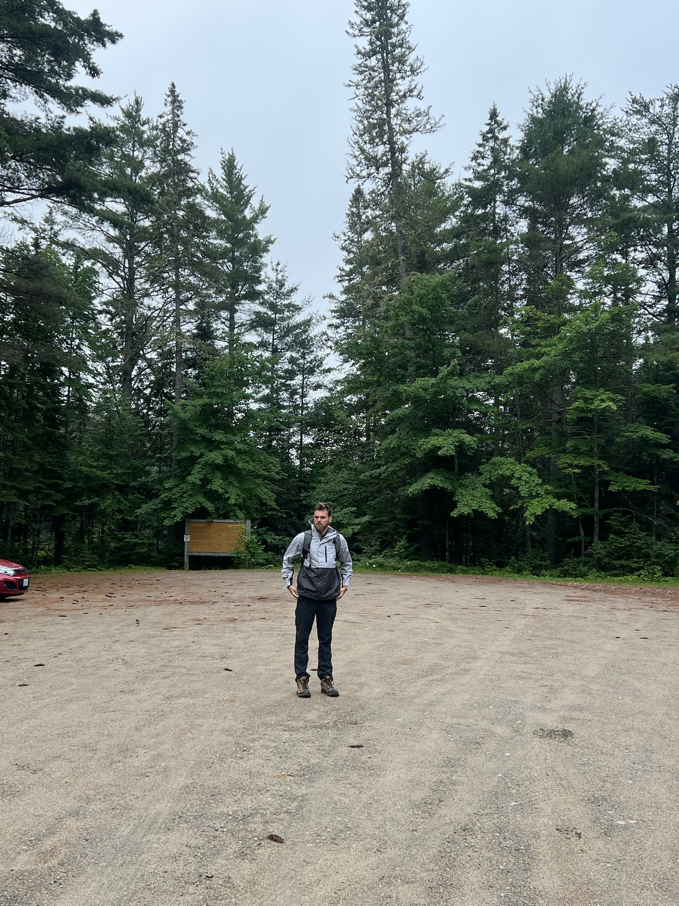
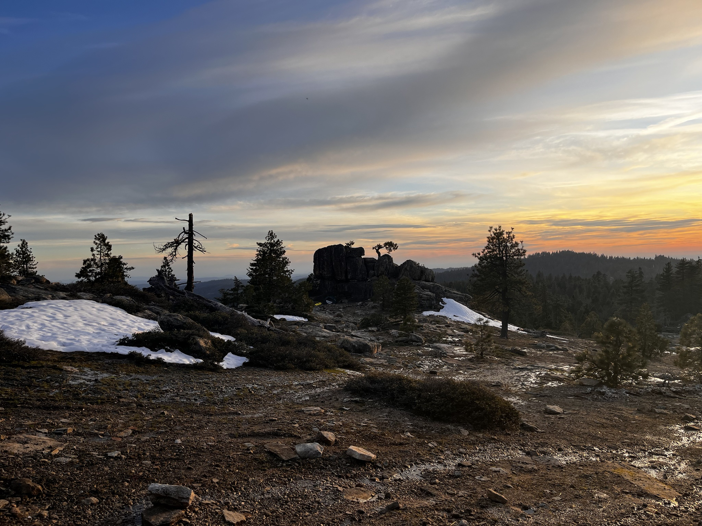

# Hi, I'm Andrew
This blog is where I post about my programming experiences and other topics that catch my interest. It also contains a list of [my publications](/publications). It runs on a custom Nord-IDE-based theme I'm developing, called "[Baltic](https://github.com/amacgillivray/baltic)". 

I've been a little busy lately, so it's taken longer than intended to get it up and running. In the meantime, I *have* published [a few gists](https://gist.github.com/amacgillivray) that are similar to what I plan to post here.



<!--  -->

## My Background
I've been working as a software developer since I was 18 (later going back to school for a BS CS). I primarily work with C++, PHP, JavaScript, and SQL. However, I've done smaller projects with a wide variety of languages including Rust, C, Haskell, Python, R, COBOL, and IBM ILE languages (DDS, RPG, CL), among others.

At work, I've led several major projects including a time tracking system (currently developing) and a purchase order system (first deployed in 2019, in daily use since). Both incorporate directly with [MAPICS](https://en.wikipedia.org/wiki/Infor_XA), running in [PASE](https://www.ibm.com/docs/en/i/7.5?topic=programming-pase-i) on the [IBM i Series](https://www.ibm.com/products/ibm-i). I also developed about 10 unique websites for Butler, most recently [bncsme.com](https://bncsme.com/) and a redesign of [butlernational.com](https://butlernational.com/), and a few small windows desktop applications (Visual C++). 

In school (BS CS '23), to put it simply, I did a lot. Living 45 miles off campus, I did as much as possible to stay involved, which meant constantly drawing triangles on the map between Overland Park (home), Olathe / the New Century AirCenter (work), and Lawrence (KU). 

I was a very active member of Dr. Esam El-Araby's [KUARQ research team](https://sites.google.com/view/esam-el-araby/research-group/member-biographies), co-authoring 7 publications on Quantum Computing and HPC. I did graphic design, photography, and video for our FSAE team, [Jayhawk Motorsports](https://www.jayhawkmotorsports.org/2022team). I was an active member, and later vice president, of the student organization for *my* preferred political party; I was also dedicated [Dole SAB](https://doleinstitute.org/ku-students/student-advisory-board/) member, where I quickly became friends with the most active students from the *other* big political party. I founded and ran one of [the more active student clubs](https://rockchalkcentral.ku.edu/organization/s2aa) on campus (and led its biggest event, hosting [Stop the Bleed](https://rockchalkcentral.ku.edu/event/9013015) with Stormont Vail Hospital). Less frequently, I could be found at KU Car Club and KU AI Organization events (I later led an IEEE competition entry with the latter).

These days, I spend my spare time hiking, finding [silly solutions](https://gist.github.com/amacgillivray/5adfeb70a194e0c458d4f54f2f3bbd87) to LeetCode problems, browsing hacker news, and frequenting my local Cars and Coffee events. 



## Get in Touch

Feel free to contact me through [LinkedIn](https://www.linkedin.com/in/andrew-macgillivray-agjm/).

